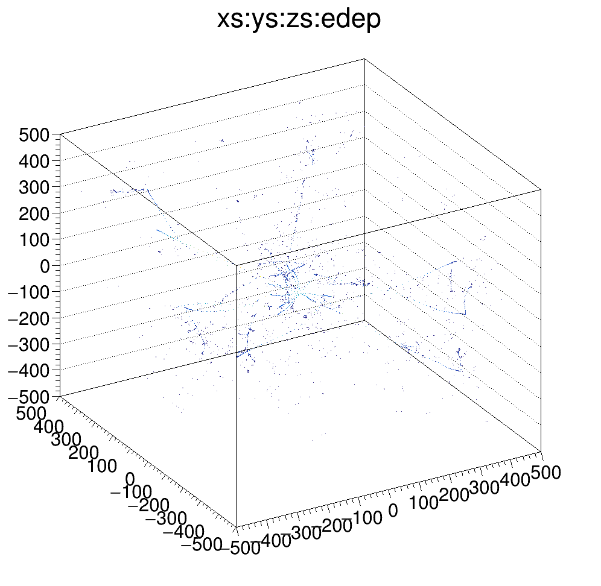
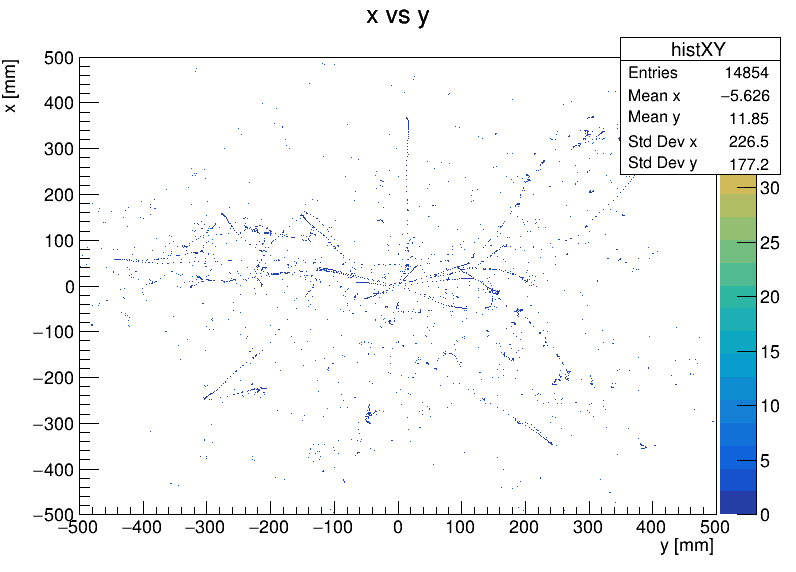
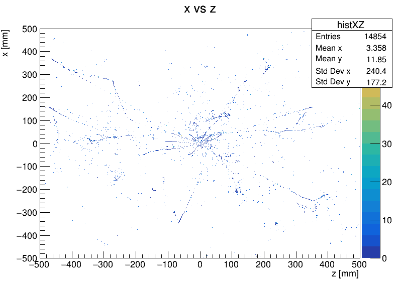

# G4LArBox: Geant4 Liquid Argon Box Simulation

## Description
G4LArBox is a Geant4-based simulation that aims to model particle interactions, and the subsequent medium response, in a simple 'box' liquid argon geometry. It is designed to research novel liquid-argon detector concepts, specifically related to rare event searches. 

