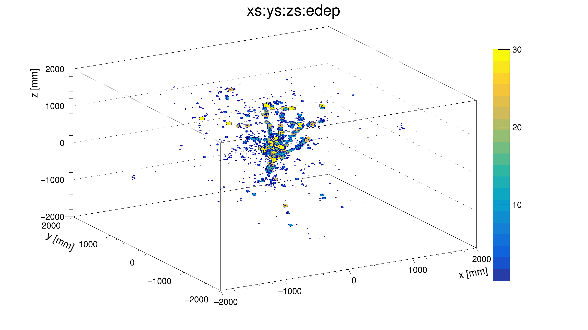
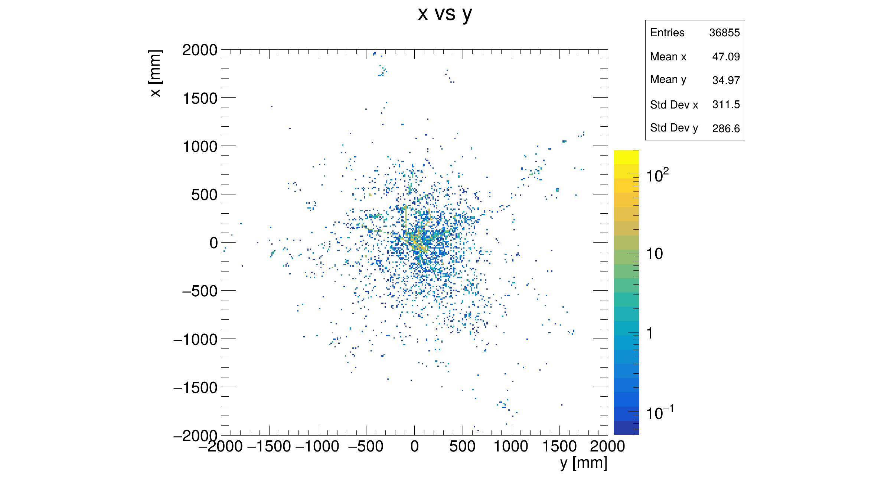
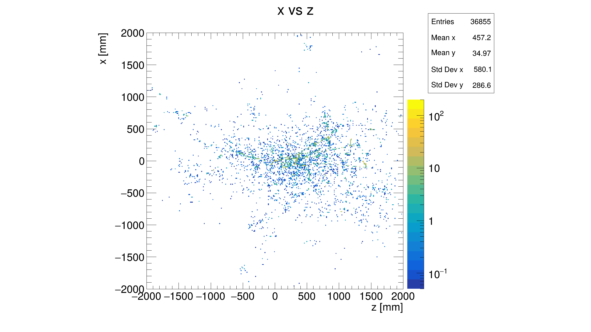

# G4LArBox: Geant4 Liquid Argon Box Simulation

## Description
G4LArBox is a Geant4-based simulation that aims to model particle interactions, and the subsequent medium response, in a simple 'box' liquid argon geometry. It is designed to research novel liquid-argon detector concepts, specifically related to rare event searches. 

The detector geometry is fixed to the MicroBooNE `TPCActive` volume from `../ubcore/ubcore/Geometry/gdml/microboone/micro-tpc.gdml`:
- x/depth: `2.5635 m`
- y/height: `2.33 m`
- z/length: `10.368 m`

The surrounding MicroBooNE `TPC` mother volume in the same ubcore GDML is `260 cm x 256 cm x 1045 cm`; this app uses `TPCActive` because it is the liquid-argon interaction volume rendered in the event displays.
The Geant4 simulation uses the NIST liquid-argon material `G4_lAr`; the display GDML active volume uses `LAr` at `1.40 g/cm3`, matching the ubcore material definition.

## Generator Modes
`G4LArBox` now supports these primary-generator inputs:
- `gps`: the existing Geant4 General Particle Source flow configured by `singlegun.mac`
- `genie_gst`: a ROOT file containing a standard GENIE `gst` tree, configured by `genie_gst.mac`
- `genie_pdecay`: a GENIE nucleon/proton-decay `gst` tree, configured by `genie_pdecay.mac`
- `corsika`: a ROOT file containing CORSIKA primary particles, configured by `corsika_cosmics.mac`
- `corsika_genie_overlay`: CORSIKA cosmics and GENIE primaries injected into the same Geant4 event, configured by `corsika_overlay_genie.mac`
- `marley`: MARLEY low-energy neutrino-argon events generated from JSON or read from a MARLEY event file, configured by `marley.mac`
- `bxdecay0`: BxDecay0 radiological and double-beta decay events, configured by `bxdecay0_Ar39.mac`, `bxdecay0_Co60.mac`, or `bxdecay0_Rn222.mac`
- `radiological`: radioactive background decays sampled in the active LAr volume, configured by `radiological_dunevd_fastdpsu_node.mac`
- `rock_neutrons`: surrounding-rock neutron backgrounds sampled on an external shell around the active volume, configured by `rock_neutrons_dunevd_fastdpsu_node.mac`

GENIE GST mode expects a ROOT tree named `gst` by default and reads the outgoing primary lepton plus the hadronic final-state particle list. The app writes a new `truthTree` into `data/output.root` containing the injected Geant4 primaries along with GENIE metadata such as interaction mode flags, target information, neutrino energy, weight, and the raw GENIE interaction vertex.
By default, GENIE input exhaustion is treated as a fatal error. Set `/generator/genie/cycleEvents true` if you want to reuse a short input file for a longer run.

CORSIKA mode expects a ROOT tree named `corsika` by default with branches `iev`, `nprimary`, `pdg[nprimary]`, `px[nprimary]`, `py[nprimary]`, `pz[nprimary]`, `x[nprimary]`, `y[nprimary]`, `z[nprimary]`, and `t[nprimary]`. Momenta are interpreted in GeV, positions in meters, and times in seconds. The helper macro `root_macros/make_corsika_cosmics.C` writes a synthetic CORSIKA-like tree for display studies; replace that file with a converted CORSIKA ROOT tree when real CORSIKA production is available.

### Astrophysical Sources
MARLEY mode samples the detector vertex in the active volume and injects every MARLEY final-state particle into Geant4. Use `/generator/marley/config config/marley_ve40ar_mono.js` to generate on the fly, or `/generator/marley/file <events.root|events.ascii|events.hepevt|events.json>` to replay pre-generated MARLEY events. The provided MARLEY config uses an isotropic incident-neutrino direction for astrophysical sources such as solar and supernova neutrinos, so these events do not assume a beamline direction. The `truthTree` records MARLEY event index, projectile/target/ejectile/residue PDG codes, excitation energy, incident direction, and the captured Geant4 primaries.

### Proton Decay
Proton-decay samples are handled with `/generator/type genie_pdecay`, which reads a GENIE nucleon-decay `gst` tree and passes the final-state particles to Geant4. The benchmark charged-kaon mode is:

```tex
p \rightarrow K^+ + \bar{\nu}
K^+ \rightarrow \mu^+ + \nu_{\mu} \quad (\tau_{K^+} = 12.38 ns, dominant branch)
\mu^+ \rightarrow e^+ + \nu_e + \bar{\nu}_{\mu} \quad (\tau_{\mu} = 2.197 us)
```

In LAr this gives the delayed-coincidence signature we want to preserve in both the event displays and optical waveforms: prompt activity from the proton-decay vertex and the stopping `K+`, followed by delayed scintillation from the charged-kaon decay products after the `K+` lifetime. The common `K+ -> mu+ nu_mu` branch can then produce a later Michel `e+` from muon decay on the microsecond scale. For this mode, `genie_pdecay.mac` reads `data/genie_pdecay_gst.root`; convert a GENIE nucleon-decay GHEP file with `gntpc -i <pdecay.ghep.root> -f gst -o data/genie_pdecay_gst.root`.

BxDecay0 mode builds and links the BxDecay0 library under `extern/bxdecay0`, samples one bulk vertex per decay in the active LAr volume, and passes each emitted electron, positron, gamma, alpha, neutron, or proton to Geant4 with the BxDecay0 momentum and emission time. Use `/generator/bxdecay0/background <nuclide> <seed> [debug]` for background decays, `/generator/bxdecay0/dbd <nuclide> <seed> <mode> <level> [debug]` for double-beta decay, or `/generator/bxdecay0/dbdranged <nuclide> <seed> <mode> <level> <min_MeV> <max_MeV> [debug]` for DBD energy-sum cuts. Momentum-direction locking is available with `/generator/bxdecay0/mdl` and `/generator/bxdecay0/mdlr`. The `truthTree` records the BxDecay0 nuclide, seed, event index, emitted PDG codes, momenta, and times.

Radiological backgrounds can run by themselves with `/generator/type radiological` or overlay any other generator with `/generator/radiological/enable true`. Activities are specified in `Bq/kg` and converted event-by-event using the active-volume mass and acquisition window. If the geometry material mass is not what you want, set `/generator/radiological/massOverrideKg`. The default fallback isotope is atmospheric-argon `39Ar` at `1.01 Bq/kg`; explicit components can be configured with:

```text
/generator/radiological/window 10 us
/generator/radiological/massOverrideKg 10000000
/generator/radiological/maxDecaysPerEvent 250
/generator/radiological/clear
/generator/radiological/addIsotope Ar39 18 39 1.01 0.0
/generator/radiological/addIsotope Ar42 18 42 0.0000404 0.0
```

The code samples the number of decays from a Poisson distribution, places each isotope uniformly in the active LAr volume, and gives it a sampled event time inside the window. For common detector-background isotopes (`Ar39`, `Ar42`, `K42`, `Kr85`, `K40`, `Rn222`) it injects approximate beta/gamma/alpha decay products at that time and lets Geant4 transport the daughters through the detector. Unknown isotopes fall back to Geant4 radioactive-decay ions. The `truthTree` records the sampled radiological isotope list, activity, active mass, expected decays, actual decays, and decay times.

Surrounding-rock neutrons can run by themselves with `/generator/type rock_neutrons` or overlay any other generator with `/generator/rockNeutrons/enable true`. The source is a rectangular shell around the active volume, padded by `/generator/rockNeutrons/shellPadding`; vertices are sampled on the shell surface and launched inward with `cosine`, `isotropic`, or `target` directions. The intensity can be set directly with `/generator/rockNeutrons/meanPerEvent`, as a total `/generator/rockNeutrons/rate` in Hz over the source shell, or as `/generator/rockNeutrons/flux` in `cm^-2 s^-1`. The default spectrum is a configurable radiogenic-shaped few-MeV spectrum, with `exponential`, `flat`, and `mono` alternatives:

```text
/generator/type rock_neutrons
/generator/rockNeutrons/window 10 us
/generator/rockNeutrons/flux 1e-6
/generator/rockNeutrons/shellPadding 100 cm
/generator/rockNeutrons/spectrum radiogenic
/generator/rockNeutrons/energyRange 0.1 10 MeV
/generator/rockNeutrons/energyMean 2 MeV
/generator/rockNeutrons/direction cosine
```

The `truthTree` records `rock_neutron_expected`, `rock_neutron_count`, sampled source positions, times, kinetic energies, directions, and shell-face IDs so these external neutron backgrounds can be separated from internal LAr radiological activity in displays and waveform studies.

## Fast Optical And Electronics Response
The event output includes optical-hit branches and digitized electronics waveform branches. By default, explicit Geant4 optical photons can still be transported to SiPM volumes and recorded as optical hits.

For faster module-scale studies, set `G4LARBOX_FAST_OPTICAL=1`. In this mode, each ionization/scintillation step is converted directly into detected optical hits with `OpticalResponse`, using geometric solid angle, absorption, Rayleigh survival for the prompt component, and a diffusion-like delayed component. Explicit Geant4 optical photons are killed to avoid double counting. Hits are marked in `optical_volume` as `fastOpticalDirect` or `fastOpticalDiffuse`, and `fast_optical_hits` records the per-event contribution.

Useful tuning variables:
```bash
G4LARBOX_FAST_OPTICAL=1
G4LARBOX_FAST_OPTICAL_COLLECTION_EFF=0.03
G4LARBOX_FAST_OPTICAL_DIFFUSE_SCALE=0.25
G4LARBOX_FAST_OPTICAL_ABS_LENGTH_MM=20000
G4LARBOX_FAST_OPTICAL_RAYLEIGH_LENGTH_MM=550
G4LARBOX_FAST_OPTICAL_SEED=271828
```

Electronics noise and dark counts are also configurable through environment variables:

```bash
G4LARBOX_ELECTRONICS_SAMPLE_FREQUENCY_MHZ=64
G4LARBOX_ELECTRONICS_TIME_BEGIN_US=0
G4LARBOX_ELECTRONICS_TIME_END_US=10
G4LARBOX_ELECTRONICS_DARK_RATE_HZ=0
G4LARBOX_ELECTRONICS_ADC_BASELINE=2048
G4LARBOX_ELECTRONICS_ADC_BASELINE_SPREAD=3.4
G4LARBOX_ELECTRONICS_ADC_SAMPLE_NOISE_SIGMA=1.5
G4LARBOX_ELECTRONICS_GAIN_MEAN_ADC=20
G4LARBOX_ELECTRONICS_GAIN_SPREAD=0.05
G4LARBOX_ELECTRONICS_PEDESTAL_FLUCTUATION_RATE_HZ=0
G4LARBOX_ELECTRONICS_STORE_NOISE_ONLY_CHANNELS=0
G4LARBOX_ELECTRONICS_SEED=314159
```

For a radiological noise-floor study, set the activity window in the generator macro and tune the electronics independently. For example, `G4LARBOX_ELECTRONICS_CHANNEL_COUNT=2496`, nonzero `G4LARBOX_ELECTRONICS_DARK_RATE_HZ`, and `G4LARBOX_ELECTRONICS_ADC_SAMPLE_NOISE_SIGMA` give each active waveform a controllable ADC floor; `G4LARBOX_ELECTRONICS_STORE_NOISE_ONLY_CHANNELS=1` writes baseline/noise waveforms even for channels without optical hits, which is useful for trigger/noise-occupancy studies but increases the ROOT file size.

The fast optical model can be selected with `G4LARBOX_FAST_OPTICAL_MODEL`:

- `legacy` keeps the original panel-style fast response.
- `node` uses a DUNE Vertical Drift FastDPSU node readout model with an 8 x 39 x 8 node lattice, geometric acceptance, LAr absorption, Rayleigh survival, and delayed diffuse light.
- `arapuca` uses a LArSoft-style `PhotonLibraryData` ROOT photon library for the DUNE VD ARAPUCA readout.
- `dunevd` runs both the FastDPSU node model and the ARAPUCA photon-library model in the same event.

ADC waveforms now carry an `electronics_channel_readout` branch alongside `electronics_channel`, with values such as `node`, `arapuca`, `legacy`, or `unknown`. The ROOT plotting macro uses that branch, and falls back to `optical_volume`/`optical_copy_number` for older files, so FastDPSU node and ARAPUCA ADC traces are drawn with distinct colors and readout-split sums rather than being folded into one anonymous channel set.

Example DUNE VD fast optical setup:
```bash
G4LARBOX_FAST_OPTICAL=1
G4LARBOX_FAST_OPTICAL_MODEL=dunevd
G4LARBOX_PHOTON_LIBRARY_FILE=/path/to/PhotonLibrary_dunevd10kt_3view_30deg_v5_refactored_1x8x14ref_argon_active_removed.root
G4LARBOX_PHOTON_LIBRARY_INTERPOLATE=1
G4LARBOX_ARAPUCA_PDE=0.027
```

The photon-library reader expects a LArSoft-compatible ROOT tree named `PhotonLibraryData` with `Voxel`, `OpChannel`, and `Visibility` branches. `ReflVisibility` is read when present. The default DUNE VD voxelization follows the LArSoft DUNE VD argon photon-visibility service: `NX=85`, `NY=174`, `NZ=220`, `X=[-425,425] cm`, `Y=[-781.26,781.26] cm`, `Z=[-104.0305,2195.6405] cm`. Override these with:

```bash
G4LARBOX_PHOTON_LIBRARY_NX=85
G4LARBOX_PHOTON_LIBRARY_NY=174
G4LARBOX_PHOTON_LIBRARY_NZ=220
G4LARBOX_PHOTON_LIBRARY_XMIN_CM=-425
G4LARBOX_PHOTON_LIBRARY_XMAX_CM=425
G4LARBOX_PHOTON_LIBRARY_YMIN_CM=-781.26
G4LARBOX_PHOTON_LIBRARY_YMAX_CM=781.26
G4LARBOX_PHOTON_LIBRARY_ZMIN_CM=-104.0305
G4LARBOX_PHOTON_LIBRARY_ZMAX_CM=2195.6405
G4LARBOX_PHOTON_LIBRARY_CHANNELS=0
```

FastDPSU node geometry can be tuned without editing code:

```bash
G4LARBOX_NODE_STRINGS_Y=8
G4LARBOX_NODE_STRINGS_Z=39
G4LARBOX_NODE_COUNT_X=8
G4LARBOX_NODE_PITCH_MM=1500
G4LARBOX_NODE_CENTRAL_GAP_MM=300
G4LARBOX_NODE_EFFECTIVE_AREA_MM2=100
G4LARBOX_NODE_CHANNEL_OFFSET=-1
```

### Background-Uncertainty Study Samples
The DUNE VD delayed-coincidence background study can be regenerated with ROOT in Docker:

```bash
EVENTS=2500 ./scripts/run_dunevd_background_uncertainty_study.sh
```

This writes `data/background_uncertainty/dunevd_background_uncertainty_samples.root`
with a `sampleTree` for clean proton decay, proton-decay overlay, isotropic
MARLEY-like astrophysical events, internal radiological activity, external rock
neutrons, and noise-only windows under several nuisance scenarios. It also
writes individual ROOT-style figures for the delayed scintillation profile,
node and ARAPUCA waveform decompositions, radiological noise floor,
rock-neutron spectrum variations, delayed-coincidence background envelopes, and
DUNE VD event displays. The event displays are equal-scale `z-y` projections in
centimetres, include a 5 m scale bar, and use the same coordinate frame for the
active volume, optical-node positions, ARAPUCA planes, and tracks. The matching
thesis figures are copied into `../thesis/figures`.

## FastDPSU GDML Markers
The repository includes a small GDML patcher for sparse fiber-coupled fast-dSiPM/DPSU studies:

```bash
python3 scripts/fastdpsu_geometry_patch.py \
  --input gdml/ndlar_single_module.gdml \
  --output gdml/ndlar_single_module_fastdpsu.gdml \
  --parent volTPCActive \
  --nx 1 --ny 1 --nz 1 \
  --margin-cm 10 \
  --housing-material LAr \
  --sensor-material LAr
```

The patcher adds `volFastDPSUHousing` and `volOpDetSensitive_FastDPSU` as daughters of the chosen active logical volume. `G4LArBox` treats any logical volume named `volOpDetSensitive_*` as an optical detector, records hits in the existing optical branches, and uses the FastDPSU housing copy number as the marker channel for this nested placeholder geometry.

To smoke-test the generated ND-LAr marker file:

```bash
./G4LArBox -d fastdpsu_ndlar.mac -g optical_fastdpsu_ndlar.mac
```

For DUNE VD studies, use a nowires GDML from the matching `dunecore` release or commit and patch `volTPCActive` first. The generated marker geometry is a diagnostic starting point: validate loading, overlaps, optical hits, and channel bookkeeping before adding real sensor materials, fibers, surfaces, or support structures.

## Image Macros
ROOT batch macros are included for event-by-event detector images:
- `root_macros/detector_view.C`: saves XZ, YZ, and XY detector-view energy-deposit projections for one event
- `root_macros/recombination_view.C`: saves a six-panel XZ comparison showing charge and light before and after the recombination model
- `root_macros/box_gdml_event_display.C`: imports `gdml/lar_box.gdml` with ROOT/TGeo and overlays the Geant4 event tracks in a g4numi-style display

Example usage:
```bash
root -b -q 'root_macros/detector_view.C("data/output.root",0,"data/detector_view_event0.pdf")'
root -b -q 'root_macros/recombination_view.C("data/output.root",0,"data/recombination_view_event0.pdf")'
root -b -q 'root_macros/box_gdml_event_display.C("data/output.root",0,"gdml/lar_box.gdml","data/event_displays/box_event0_gdml","png,pdf",60000,"clean,debug")'
```

These macros assume the detector is the fixed MicroBooNE `TPCActive` volume and interpret stored Geant4 positions in centimeters for plotting.
The simulation Docker image has enough ROOT for tree I/O; the GDML display uses `rootproject/root` for ROOT Geometry/GDML rendering, following the same split used by the g4numi visualization scripts.
For DUNE VD GDML displays, `box_gdml_event_display.C` also understands the full `volEnclosureTPC` active envelope. Set `G4LARBOX_FORCE_PROJECTION=1` for the publication-style wireframe projection, `G4LARBOX_DISPLAY_VIEW=zy|zx|xy` to choose the visible axes, and `G4LARBOX_DISPLAY_LOCAL_EVENT=1` when the event is physically too small to see on the full 60 m detector outline.

To run the Geant4 simulation and render the event display entirely inside Docker:
```bash
./scripts/render_box_event_display_docker.sh simplebox.mac thesis_bnb_like.mac
```

The Docker wrapper defaults to a three-event synthetic GENIE GST file when using `thesis_bnb_like.mac`, writes `data/output.root`, then renders individual clean and debug GDML displays such as `data/event_displays/box_event0_gdml_clean.png`, `data/event_displays/box_event1_gdml_clean.png`, and `data/event_displays/box_event2_gdml_clean.png`. The display macro draws grouped track polylines over an unshaded active-TPC wireframe using a uniform centimeter-to-pixel scale for the TPC length and height, with neutrino flight shown as a grey dashed incoming line along the truth incident direction when available. Legacy GENIE beam samples keep the historical `+z` direction fallback; MARLEY and other astrophysical samples do not assume a beamline. For Lambda events, the display reads `trackTree` and marks the Lambda decay point and inside/outside-active status in the main view. Charged and neutral particles use bright solid colors so the event remains legible on a white background. The display is generator-agnostic: GENIE and MARLEY events can be rendered the same way once their final-state tracks are written to the same Geant4 output trees.

Useful display controls:
```bash
EVENT_COUNT=5 ./scripts/render_box_event_display_docker.sh simplebox.mac thesis_bnb_like.mac
EVENT_INDICES=0,4,7 SIM_EVENTS=8 ./scripts/render_box_event_display_docker.sh simplebox.mac thesis_bnb_like.mac
RENDER_MODES=clean,debug TRACK_PDGS=2212,211,-211 PRIMARY_ONLY=1 ./scripts/render_box_event_display_docker.sh simplebox.mac thesis_bnb_like.mac
MIN_STEP_CM=0.02 MAX_TRACKS=200 ./scripts/render_box_event_display_docker.sh simplebox.mac thesis_bnb_like.mac
```

To make CORSIKA-only cosmic-ray displays through the MicroBooNE active TPC:
```bash
EVENT_COUNT=20 SIM_EVENTS=20 SYNTHETIC_CORSIKA_EVENTS=20 RENDER_MODES=clean OUTPUT_FORMATS=png OUTPUT_PREFIX='data/event_displays/corsika_event{event}_gdml' ./scripts/render_box_event_display_docker.sh simplebox.mac corsika_cosmics.mac
```

To illustrate overlay, this command injects the CORSIKA primaries and the GENIE GST final state into the same Geant4 event before rendering:
```bash
EVENT_COUNT=20 SIM_EVENTS=20 SYNTHETIC_CORSIKA_EVENTS=20 SYNTHETIC_GST_EVENTS=20 RENDER_MODES=clean OUTPUT_FORMATS=png OUTPUT_PREFIX='data/event_displays/corsika_overlay_event{event}_gdml' ./scripts/render_box_event_display_docker.sh simplebox.mac corsika_overlay_genie.mac
```

In the overlay displays, the grey dashed incoming neutrino line marks the GENIE interaction vertex while the downward-going cosmic tracks come from the CORSIKA input.

For the Lambda containment study, `lambda_cc.mac` uses a synthetic `nu_mu` CC GST sample with a primary `Lambda` and lets Geant4 decay it. The detector is an active `G4_lAr` TPC inside a larger invisible world, so Lambda decays outside the active volume can be tracked:
```bash
EVENT_COUNT=6 ./scripts/render_box_event_display_docker.sh simplebox.mac lambda_cc.mac
docker run --rm --platform linux/amd64 -v "$PWD:/work" -w /work --entrypoint /bin/bash rootproject/root -lc 'root -l -b -q "root_macros/lambda_containment_summary.C(\"data/output.root\",\"data/lambda_containment_summary.csv\")"'
```





